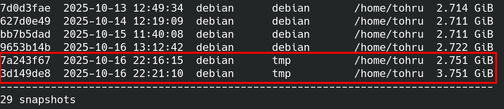
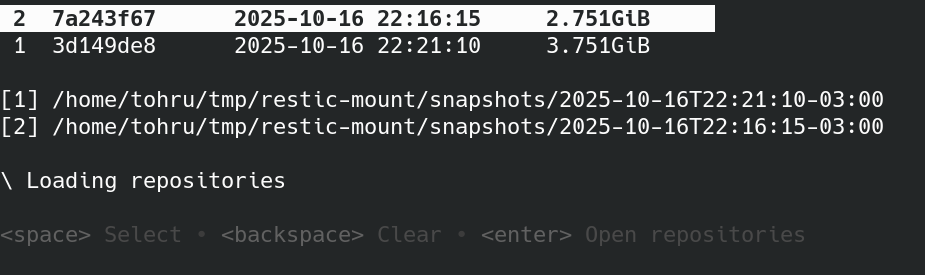
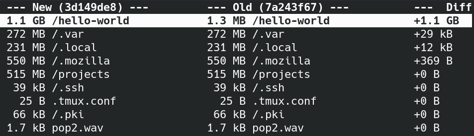

# gestic

A diff tool for restic snapshots.

## Problem
- Your last [restic](https://github.com/restic/restic) snapshot is `snapshot_old`
- You make a new snapshot `snapshot_new`
- `snapshot_new` have +800MB on size compared to `snapshot_old`
- You want to find what changed

Sometimes, we install some program or download a file that is not worth to keep in the snapshots, like VM files.
This tool helps you quickly find what file or directory is causing the change in size.

## Usage
**Make sure your restic repository is mounted before run it.**

`restic mount /mnt/YOUR_MOUNT_POINT`

After mount the repo, you can use the tool:

`gestic --repo /mnt/YOUR_RESTIC_REPO --mount /mnt/YOUR_MOUNT_POINT`

You can also use environment variables:
- `RESTIC_REPOSITORY`: same as `--repo`
- `RESTIC_MOUNTPOINT`: same as `--mount`

Use the help on screen to move around and compare snapshots.

## Usage Example
- Create snapshot A.
- Create a 1GB file.
- Create snapshot B.

- Mount the repository: `restic mount ~/tmp/restic-mount`
- Run `gestic` against the repository and mount point: `gestic --repo /mnt/storage/__restic --mount /home/$USER/tmp/restic-mount`
- Select snapshot B, then A (use the spacebar to select), and press Enter.

- Enter/exit directories using `H` and `L`.
- Move up and down using `J` and `K`.
- Use `1`, `2`, or `3` to copy the current path.

The advantage of using `gestic` is the ability to **navigate both snapshots** simultaneously.

## Installation
- Clone the repo
- Run `make install`

